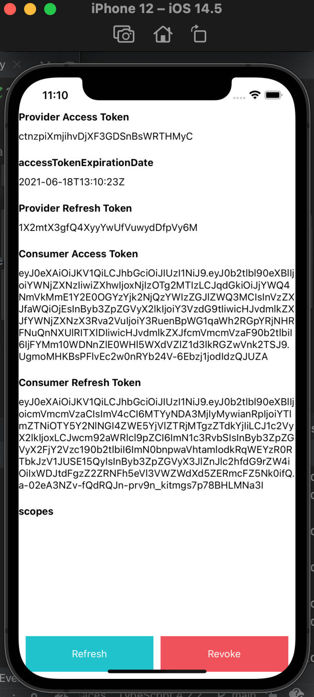

# React Native OAuth Login Tutorial-ish

React Native OAuth login using react-native-app-auth
and a custom OAuth provider. Requires: iOS 13+

Created on 12 June 2021

Created by: [Andrew Chen Wang](https://github.com/Andrew-Chen-Wang)

Table of Contents enabled in GitHub `README` on the top left.

---
### Introduction

This project is educational for me in creating an OAuth consumer.
This React Native repository demonstrates both signing up and
logging in via the app alone.

This project uses my tutorial on a custom Django OAuth provider
and consumer. If you'd like to test this project, run the
provider and mobile consumer at this project:
https://github.com/Andrew-Chen-Wang/django-social-provider-and-consumer-tutorial

Why create this? I have a custom OAuth provider. I wanted to create 
an OAuth consumer for a new project called [Hear Ye](https://hearye.us/).

Note: I only support iOS 13+; most iOS users are already above that (the 
purpose was to avoid some installation steps).

### Usage

Run instructions for Android:
- Have an Android emulator running (the quickest way to get started), or a device connected.
- In the root directory of this repository, run: `npx react-native run-android`

Run instructions for iOS:
- In the root directory of this repository, run: `npx react-native run-ios`
- or:
  - Open `./ios/oauth_login.xcworkspace` in Xcode **OR** run `xed -b ios`
  - After doing either, hit the `Run` button

Run instructions for macOS:
- See https://aka.ms/ReactNativeGuideMacOS for the latest up-to-date instructions.

---
### Tutorial

In this tutorial, I've split it up into sections. Each section
has a dropdown toggle button so that you can open/close sections you've
already completed.

<details>
<summary><strong>Section 1 - Installing and setting up the prerequisites</strong></summary>

Assuming you have a React Native app already set up:

1. `npm install react-native-app-auth react-native-keychain --save`
1. Go to [android/app/build.gradle](./android/app/build.gradle).
   Find a line that says `defaultConfig`. Inside its curly braces (i.e. `{}`),
   add the lines:
   ```
   manifestPlaceholders = [
      appAuthRedirectScheme: 'com.oauthlogin.auth'
   ]
   ```
   `appAuthRedirectScheme` is a weird value. Just make it your Android package name
   with NO underscores. Follow Note 1 in the Notes section of Section 1 for further guidance.
   ([Updated instructions if needed](https://github.com/FormidableLabs/react-native-app-auth#android-setup))
1. For iOS, we only support iOS 13+ 
   ([>90% of users are on iOS 14 and ~=8% on iOS 13 as of 12 June 2021](https://developer.apple.com/support/app-store/)).
   I'm using CocoaPods. We need to do `cd ios && pod install`. For other
   installation options (e.x. with Carthage), follow:
   https://github.com/FormidableLabs/react-native-app-auth#install-native-dependencies
1. In [ios/oauth_login/AppDelegate.h](./ios/oauth_login/AppDelegate.h), change some lines to look like:
   ```diff
   + #import "RNAppAuthAuthorizationFlowManager.h"
    
   - @interface AppDelegate : UIResponder <UIApplicationDelegate, RCTBridgeDelegate>
   + @interface AppDelegate : UIResponder <UIApplicationDelegate, RCTBridgeDelegate, RNAppAuthAuthorizationFlowManager>
    
   + @property(nonatomic, weak)id<RNAppAuthAuthorizationFlowManagerDelegate>authorizationFlowManagerDelegate;
   ```
1. Add the following code to `AppDelegate.m` (to support iOS <= 10 and React Navigation deep linking):
   ```diff
   + - (BOOL)application:(UIApplication *)app openURL:(NSURL *)url options:(NSDictionary<NSString *, id> *) options {
   +  if ([self.authorizationFlowManagerDelegate resumeExternalUserAgentFlowWithURL:url]) {
   +    return YES;
   +  }
   +  return [RCTLinkingManager application:app openURL:url options:options];
   + }
   ```
1. If you want to support universal links (Universal Links is when you click on a link in your web browser, 
   and the page asks if you want to use the app instead. Basically, do it!), add the following to `AppDelegate.m`
   under `continueUserActivity` (note: you may not be able to find `userActivity` in `AppDelegate.m`,
   full code is under Note 2 in Section 1 below):
   ```diff
   + if ([userActivity.activityType isEqualToString:NSUserActivityTypeBrowsingWeb]) {
   +   if (self.authorizationFlowManagerDelegate) {
   +     BOOL resumableAuth = [self.authorizationFlowManagerDelegate resumeExternalUserAgentFlowWithURL:userActivity.webpageURL];
   +     if (resumableAuth) {
   +       return YES;
   +     }
   +   }
   + }
   ```
1. If you need integration with Swift instead, follow:
   https://github.com/FormidableLabs/react-native-app-auth#integration-of-the-library-with-a-swift-ios-project

<details><summary>Notes</summary>

1. `appAuthRedirectScheme` is a weird value. Based on my limited understanding of the Android
   ecosystem, it's a unique "handler" or identifier registered on an Android device. You should
   specify a redirect uri that is very specific to a domain. Read up on a slightly better yet still
   confusing explanation and example here: 
   https://github.com/openid/AppAuth-android#capturing-the-authorization-redirect
   You may also want to read this note as well: https://github.com/FormidableLabs/react-native-app-auth/tree/main/Example#notes
   A small snippet from that URL: 
   We recommend using a custom scheme based redirect URI (i.e. those of form my.scheme:/path), as this is the most 
   widely supported across all versions of Android. To avoid conflicts with other apps, it is recommended to 
   configure a distinct scheme using "reverse domain name notation". This can either match your service web domain 
   (in reverse) e.g. `com.example.service` or your package name `com.example.app` or be something completely new as 
   long as it's distinct enough. Using the package name of your app is quite common, but it's not always possible if 
   it contains illegal characters for URI schemes (like underscores) or if you already have another handler for 
   that scheme - so just use something else.
1. Full code can be anywhere before `@end`:
   ```
   - (BOOL) application: (UIApplication *) application
    continueUserActivity: (nonnull NSUserActivity *)userActivity
    restorationHandler: (nonnull void (^)(NSArray<id<UIUserActivityRestoring>> * _Nullable))restorationHandler
    {
      if ([userActivity.activityType isEqualToString:NSUserActivityTypeBrowsingWeb]) {
        if (self.authorizationFlowManagerDelegate) {
          BOOL resumableAuth = [self.authorizationFlowManagerDelegate resumeExternalUserAgentFlowWithURL:userActivity.webpageURL];
          if (resumableAuth) {
            return YES;
          }
        }
      }
      return [RCTLinkingManager application:application continueUserActivity:userActivity restorationHandler:restorationHandler];
   }
   ```

</details>
</details>

<details>
<summary><strong>
Section 2 - Setup your provider and consumer
</strong></summary>

1. Go to https://github.com/Andrew-Chen-Wang/django-social-provider-and-consumer-tutorial
   to set up your OAuth provider and mobile consumer. Follow the steps there
   to grab a Provider/server and a Consumer/mobile-consumer.

</details>

<details>
<summary><strong>
Section 3 - Implementation
</strong></summary>

1. I'm using the example React Native app that FormidableLabs (the authors of react-native-app-auth provides).
   Don't worry; we're going to customize the code for authentication. It's mostly because I'm lazy, but I only copied 
   [`App.js`](https://github.com/FormidableLabs/react-native-app-auth/blob/main/Example/App.js) and
   [`components` directory](https://github.com/FormidableLabs/react-native-app-auth/tree/main/Example/components) for 
   their design: https://github.com/FormidableLabs/react-native-app-auth/tree/main/Example
1. I've changed `Page.js` to avoid the random background image from the assets folder. If you copy
   the `assets` folder too, you won't need to change `Page.js`:
   ```jsx
   const Page = ({children}) => (
      <SafeAreaView style={styles.safe}>{children}</SafeAreaView>
   );
   ```
1. Go to `App.js`. We're going to add our configurations. Replace the values in the `config`
   variable with whatever you need. If you still don't understand the redirect uri,
   read this note: https://github.com/FormidableLabs/react-native-app-auth/tree/main/Example#notes
1. Find every instance in App.js where the function `handleAuthorize` is used. 
   Replace whatever the value is inside with your config key value (mine was custom)
1. Then run the app! Make sure your mobile consumer and provider are up. 
   `npm run ios` or `npm run android`. It should look like this after signing
   up a user on your provider first (since you're logging in from the provider):
   


</details>

Great, you're done! What you'll probably want to do next is implement an
automatic refresh token mechanism on app start and throughout your app
lifecycle. Take a look at [my mobile-auth-example](https://github.com/Andrew-Chen-Wang/mobile-auth-example)
to see what I mean using Swift and Kotlin (the native languages for their
respective OS's).

In this tutorial, we did not utilize `react-native-keychain`, instead, opting
for using a JS Object for simplicity. These tokens must be kept a secret,
and the device's built-in keychain can assist with that.

---
### License

I've licensed this repository under the Apache 2.0 License.

```
Copyright 2021 Andrew Chen Wang

Licensed under the Apache License, Version 2.0 (the "License");
you may not use this file except in compliance with the License.
You may obtain a copy of the License at

       https://www.apache.org/licenses/LICENSE-2.0

Unless required by applicable law or agreed to in writing, software
distributed under the License is distributed on an "AS IS" BASIS,
WITHOUT WARRANTIES OR CONDITIONS OF ANY KIND, either express or implied.
See the License for the specific language governing permissions and
limitations under the License.
```
